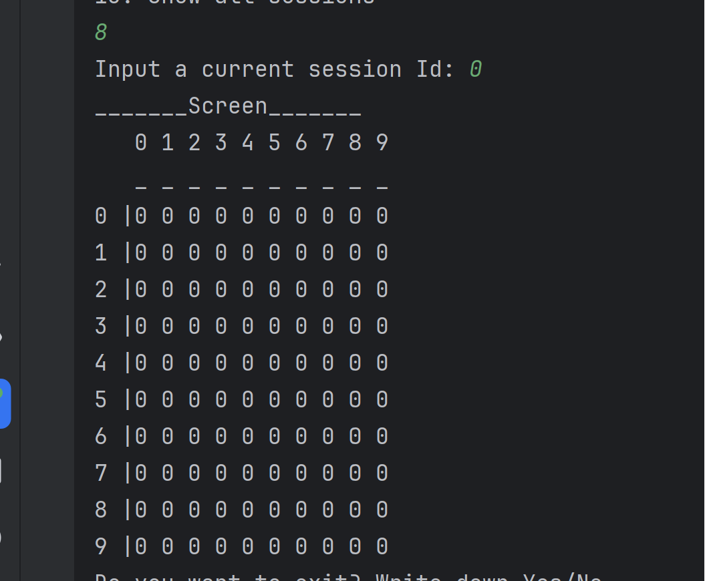

## Тут я объясню, почему мой код ~~не говно~~ работает хорошо.

Welcome to my cinema managing system! Она создана для работников кинотеатра. Программа создана на gradle 8.5 и представляет несколько классов (или объектов), взаимодействующих между собой.

**Посмотрим, как пользоваться этой системой**

Для работы в системе работнику нужно обязательно авторизоваться, поэтому в самом начале работы ему предложат это сделать:

Если пользователь уже регистрировался в системе - то ему следует ввести Yes/Да, тогда ему предложат ввести логин и пароль. Если нет - предложат зарегестрироваться. Пароли защищены хэшированием с помощью алгоритма *SHA-256* . 

Если пользователя еще нет в базе, но он выбрал вместо регистрации обычную авторизацию, то ему сообщат об этом и предложат зарегистрироваться

Пройдём регистрацию

После авторизации/регистрации работнику будет предложен список доступных команд:

Чтобы выбрать команду, нужно ввести в консоль ее номер. Если работник введёт некорректный номер команды (например, число 16 или вообще другой тип данных), то система сообщит ему об этом:

**Посмотрим на выполнение рабочих команд:**

Стоит отметить, что для хранения данных я использую сериализацию в .json. В отдельных файлах хранятся данные о фильмах, которые находятся в прокате, сеансах и проданных билетах. Почему .json? Во-первых, файлы .json довольно мало весят и представление данных в этом формате довольно компактное, поэтому в них удобно хранить большой объем данных (например, проданных билетов в любом кинотеатре довольно много). К тому же, .json очень удобно сериализовать/десериализовать, поэтому именно он был выбран для хранения данных. Сериализация/десериализация производится на каждой шаге внутреннего цикла, то есть перед каждой новой командой (это сделано для случая, если в последовательности команд вторая будет связана с результатом первой)

1. **Добавить фильм**

Мы добавили фильм Барби в нашу базу фильмов. 

Посмотрим на файл, в котором содержится информация о фильмах в прокате:

*Ура, работает!*

Также стоит добавить, что если в продолжительности фильма пользователь введёт вместо целого числа какой-либо другой тип данных, то этому свойству будет присвоено значение по умолчанию - 0. Если позже возникнет необходимость его изменить, то это можно сделать с помощью соотв. метода.

Далее (после каждой команды) у работника спрашивают, планирует ли он сделать что-то еще (а точнее, хочет ли он выйти из системы)

Если ответ нет - то пользователю снова выводится список команд. В противном случае он выходит из аккаунта. Далее можно либо авторизоваться еще раз, либо завершить программу. 

2. **Изменить название существующего фильма** + 12. **Вывести список фильмов**

Изменим название фильма "Барби" на "Кен"

Воспользуемся командой 12 (вывести список всех фильмов) чтобы проверить, изменилось ли название фильма в базе

*Название фильма действительно поменялось!*

Аналогично можно поменять режиссера или продолжительность фильма. Достаточно выбрать соотв. команду, ввести название фильма и новый параметр.

5. **Добавить сеанс**

Помимо фильмов, мы можем добавлять сеансы с *уже существующими фильмами*. То есть для добавления сеанса необходимо, чтобы желаемый фильм уже бцл в прокате кинотеатра :)

Вот тут, например, мы пытаемся создать сеанс фильма Барби. Но в предыдущей команде мы изменили название фильм ана Кен, поэтому сеанс создать не получится.

Создадим сеанс фильма "Кен"

Ура! Наш сеанс был успешно добавлен, и если мы посмотрим на список сеансов (команда 13), то увидим его там:

Помимо сообщения о успешном добавлении, мы получили id сессии, который потом будет использоваться в методах изменения данных о сеансе. 

За валидность даты отвечает метод **dateValidation**. Если была введена некорректная дата, он об этом сообщит:

5. **Изменить название фильма/дату (методы 6-7)**
Поменяем дату сеанса на 27/12/2023 12:30. Для этого у нас запрашивают id сеанса.

Посмотрим на список наших сеансов:

Дата и время действительно изменились! Точно так же можно поменять и фильм, который будет показан в данном сеансе.

6. **Покупка/возврат билетов (методы 9-10)**

Перейдём к самому интересному: покупке билетов. Обращаю внимание, что я использовал слово sell, поскольку сотрудник все же продает, а не покупает билет. Сначала необходимо ввести id сессии, билет на которую нужно купить (все идентификаторы можно увидеть, если вывести список всех доступных сеансов). Далее высвечиваетсы схема зала (по вертикали - номер ряда (row), по горизонтали - номер столбца (column)). 0 означает свободное место, 1 - занятое.

Введем координаты желаемого места. *Ура, у нас получилось купить билет!*
Программа также сообщила номер билета, который понадобится при возврате.

А теперь посмотрим на схему зала данного сеанса (команда 8), чтобы убедиться, что система забронировала нам место.

Введем номер сеанса и получим:

Видим, что на нашем месте появилась единичка, а значит, что при попытке забронировать это же место повторно будет выведено сообщение об ошибке "Ooops! This place is already booked :( Try again!".

Теперь попробуем вернуть данный билет. Для этого введем номер нашего билета: 

Посмотрим на схему зала для этого сеанса, чтобы убедиться, что после возврата билета место освободилось:

*Все работает!*

6. **Возможность отмечать пользователей, пришедших на сеанс (команда 11)**
Продадим еещ один билет на фильм Ken, а затем отметим пользователя, который пришел на сеанс. Введем номер его билета: 

Пользователь успешно зарегистрирован на фильм. Информация об отметке пришедших пользователей хранится в классе Session в качестве свойства sessionVisitors.

**Это был небольшой обзор на работу основных функций программы**

Таким образом, мы сверились с техническими требованиями задания и выполнили их все. 

Можно еще немного поговорить про соблюдение принципов SOLID:

S - каждый класс отвественнен за определенный функционал. Так, класс системы отвечает за основные команды, классы (а точнее, объекты) Serializer и Authentification - за сериализацию/десериализацию файлов с данными и аутентификацию пользователей (работников). 

O - принцип открытости/закрытости. Программные сущности должны быть открыты для расширения, но не для модификации. В моей программе отсутствует наследование классов, поэтому принцип автоматически соблюдается.

L - принцип подстановки Лисков. В моей программе отсутствует наследование классов, поэтому принцип автоматически соблюдается.

I - принцип разделения интерфейсов. Функционал изменения фильмов описан в интерфейсе ChangeMovie, а сеансов - ChangeSession, поэтому принцип соблюдается.

D - принцип инверсии зависимостей. Сущности должны быть связаны через абстрации (в моем случае - интерфейсы). Так, например, мы можем добавить в интерфейс еще один метод для работы с фильмами/сеансами, при этом не изменяя уже существующие методы.
