## Тут я снова объясню, почему мой код ~~не говно~~ работает отлично!

Добро пожаловать в сервис ресторана, разработанный для гостей и администраторов заведения.

Данный проект реализован в формате клиент-сервер, где в качестве клиента выступает консольное приложение, которое отправляет GET- и POST- запросы серверному приложению. 

Перед началом работы требуется запустить серверное приложение (проект **software-design-hw2**), которое создаст локальный хост localhost:8080/, на который и будут поступать запросы пользователей.

### Немного про устройство сервера:

Серверное приложение не только принимает запросы и отправляет клиентам ответ, но и реализует основной функционал программы. 

Всего в программе несколько "слоёв":

+ "ручки" или хэндлеры - принимают запросы пользователя, обрабатывают тело POST-запросов - десериализуют данные и отправляют их на дальнейшую обработку. Всего ручек довольно много - все они располагаются в отдельных файлах "...Routing". 
+ менеджеры - основной функциональный слой, который осуществляет проверку пользователей и валидности поступивших данных, а также совершает некоторые операции с данными или передаёт их далее. Всего в программе 4 объекта-менеджера. **FoodManager** отвечает за добавление/удаление и изменение блюд в меню, **UserManager** - за все аутентификационные процедуры пользователей, **OrderManager** занимается обработкой заказов, а **UtilityManager** помогает администратору собирать статистику.
+ классы - некоторые методы, особо связанные с классом, могут не выноситься в менеджера, а вызываться непосредственно из его методов.

Классы и файлы распределены по пакетам, объединенным по общей тематике. Например, все менеджеры находятся внутри одного пакета. То же самое и для классов, интерфейсов и ручек, отвечающих за обработку заказов.

Приготовление заказов осуществляется в многопоточном режиме (количество потоков задается константой и может быть изменено)

### О клиенте:

Клиент представляет собой консольное приложение, взаимодействие с которым осуществляется с помощью ввода с клавиатуры. Вспоследствии клиент может быть преобразован в полноценное веб-приложение, ~~но у меня лапки~~.

### Работа программы
Для начала надо запустить сервер, а затем клиента.

Важно: не рекомендуется выключать приложение клиента принудительно, так как это может привести к разрыву соединения (надо по-хорошему всегда делать close()).

Когда мы запустили клиента, высвечивается приветственное послание и предложение войти/зарегистрироваться.

Зарегистрируемся как администратор. Если пользователь с таикм же логином уже существует в базе, то пользователя уведомят о том, что невозможно создать аккаунт с такими данными.

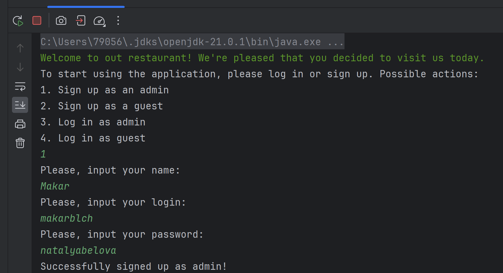

Далее высвечивается меню с доступными действиями.

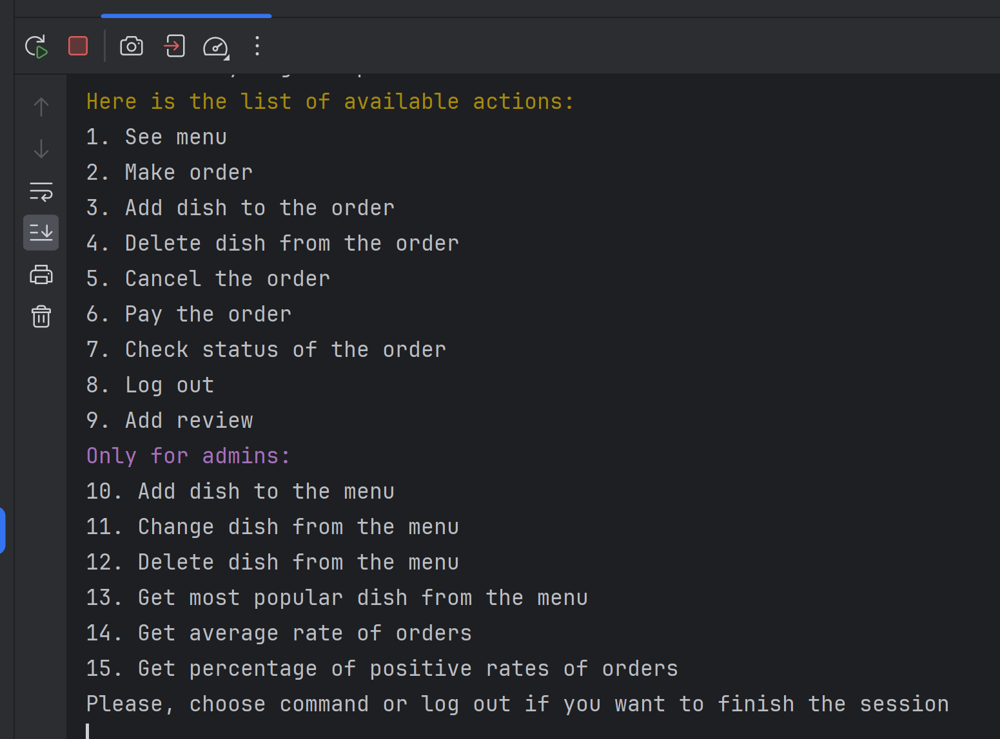

Пользователем, зарегистрированным или вошедшим в качестве гостя команды 10-15 **не** показываются. 

Давайте посмотрим на меню:

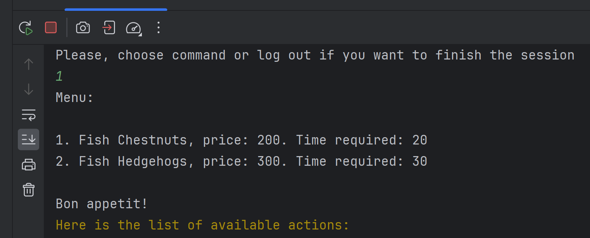

После каждой команды пользователю снова высвечивается список доступных действий.

Давайте добавим блюдо в меню:

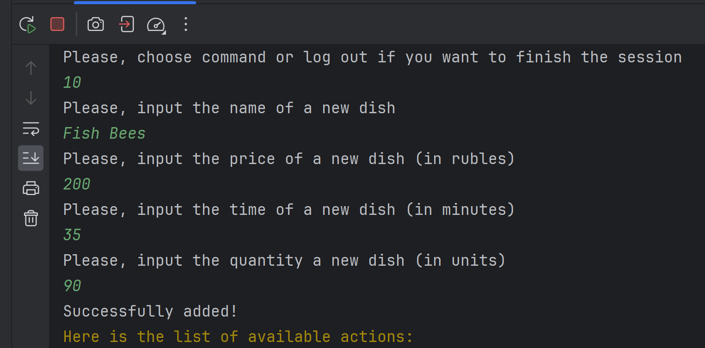

Администратору нужно ввести название, цену, время приготовления, а также количество доступных единиц (если количество меньше нуля, то выполнять заказы с этим блюдом будет невозможно!)

Посмотрим на меню еще разок:

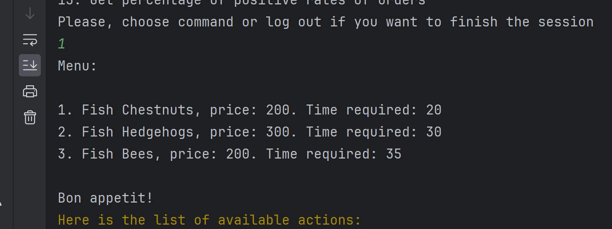

Наше блюдо успешно добавлено!

Также можно менять отдельные свойства блюд (название, или название + цена и тд.) и удалять блюда из меню.

Заметим, что если пользователь со статусом "Гость" попробует выполнить данные команды, то получит сообщение о том, что у него недостаточно прав. 

Попробуем перезайти в приложение. 

Если пользователь уже зарегистрировался в системе, то он внесен в базу данных, и достаточно просто выполнить вход:

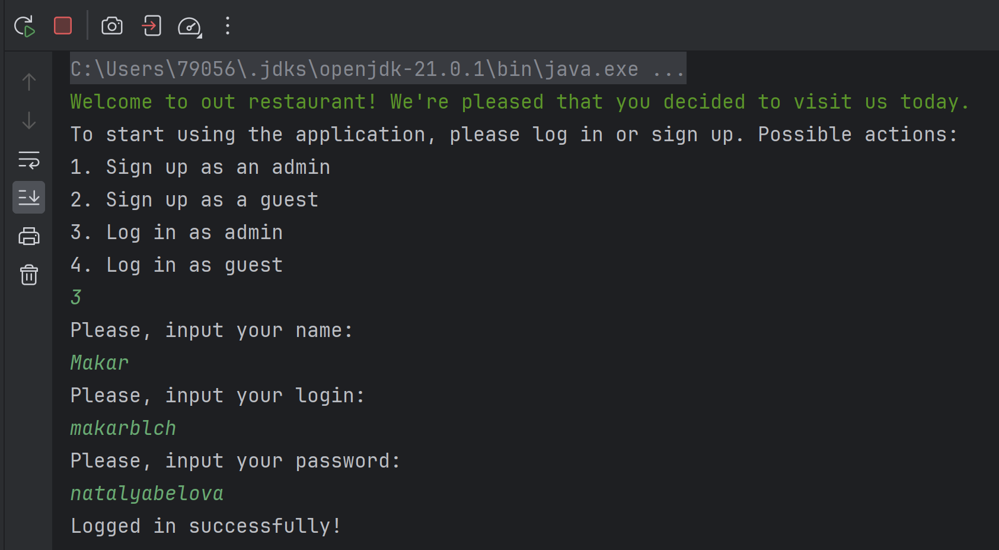

А теперь совершим заказ:

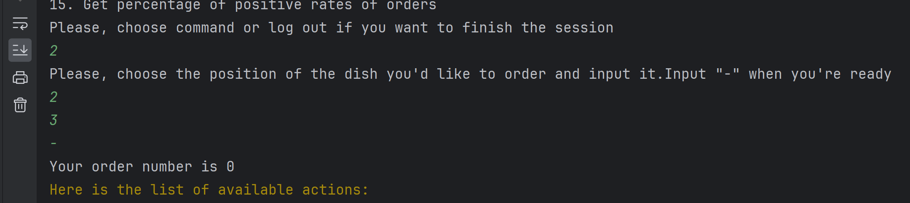

Допустим, я хочу заказать блюда под номерами 2 и 3.

Пользователю вернется номер заказа, по которому он сможет отслеживать статус и оплачивать. Заметим, что на сервере у каждого заказа есть поле с юзером, который его сделал. Если пользователь попытается отменить/оплатить не свой заказ, то он получит уведомление об ошибке. 

Проверим статус заказа:

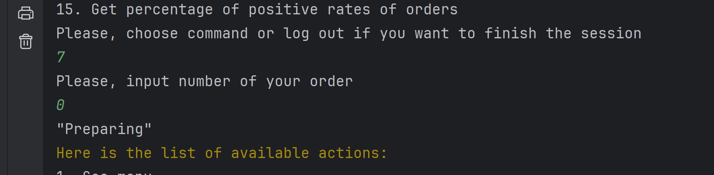

А теперь спустя время:

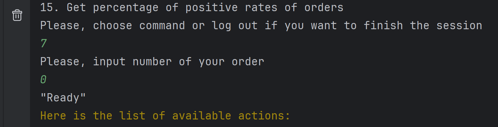

Ура! Наш заказ готов и мы можем его оплачивать. Оплатить можно только заказ со статусом Ready!

Оплатим его и оставим отзыв:

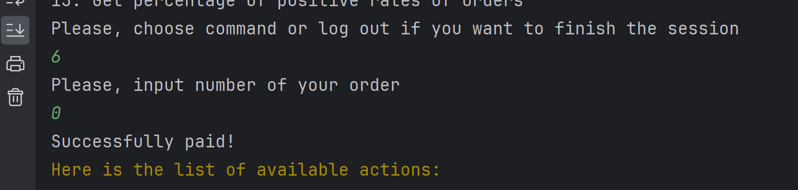
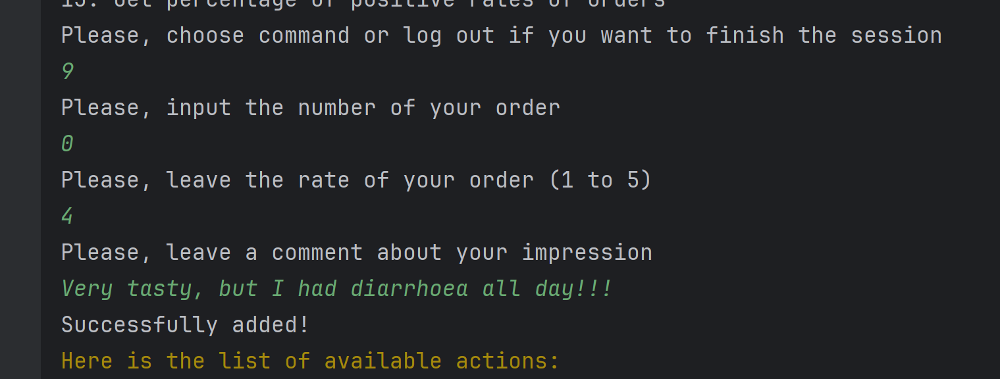

Посмотрим статус нашего заказа:

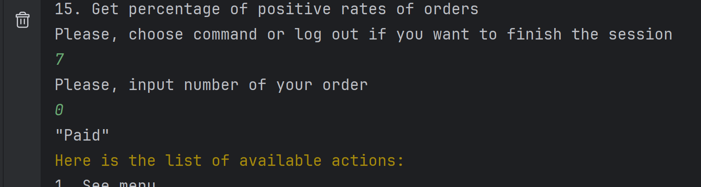

Наш заказ оплачен! А значит, мы можем довольные уйти из ресторана.

Проверим еще работу статистических показателей (для этого я создал еще два заказа, состоящих из блюда 2 и поставил им оценки 3 и 5). 

Ожидание: самое популярное блюдо - Fish Hedgehogs, средняя оценка - 4.

Реальность:
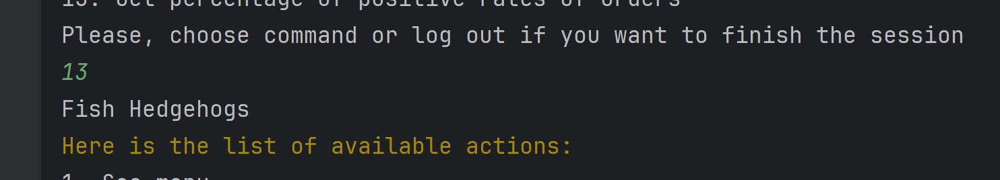
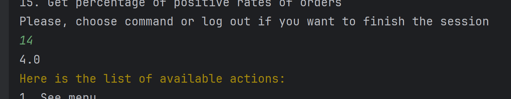

Вроде похоже на правду :) 

Добавим один негативный отзыв и посмотрим на долю положительных (она должна быть равна 0.75) 

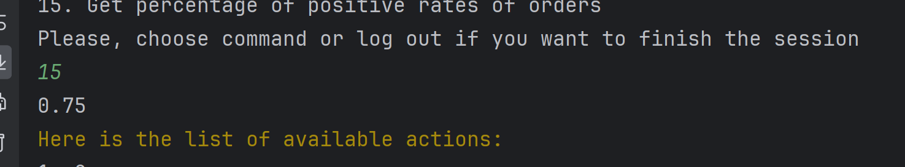

Все так! Другие команды можно посмотреть в самом проекте. 

**А теперь немного важной информации**
### О хранении данных
Данные хранятся и сериализуются в формате Json. Данный формат очень удобный для хранения истории заказов или клиентской базы, поскольку файлы .json довольно мало весят и представление данных в этом формате довольно компактное. К тому же, .json очень удобно сериализовать/десериализовать. Сериализацию и десериализацию я выполняю после каждого действия пользователя, за исключением случаев, когда есть заказы, которые готовятся - в этом случае она выполняется после приготовления, так как при сериализации статус заказа может затереться. 

### О многопоточности и системе приоретизации
Выполнение заказов происходит в отдельных потоках. Для имитации процесса приготовления я использую Thread. Когда требуется выполнить добавление блюд в заказ через order builder, используются syncronized-блоки для ограничения доступа разных потоков к одному ресурсу. Максимальное количество потоков задано константой (писал выше). Если количество заказов превышает допустимое значение, то они помещаются в специальную очередь, откуда достаются по очереди после того, как поток освобождается. Таким образом,  приоритет заказов - по времени поступления (классическая очередь)

### О паттернах проектирования

В своей работе я в явном виде использовал **одиночку** (singleton) и **строителя** (builder). Одиночка используется для реализации менеджеров (так как каждый менеджер нам нужен в единственном экземпляре) и хранилища данных. Строитель используется для реализации различных методов работы с заказами, которые вынесены из класса Order для упрощения его структуры и более лаконичной сериализации. В неявном виде использованы шаблоны **Адаптер** (на вход поступает строка, которую внутри ручек и менеджеров преобразуют к необходимому виду) и **Цепочка обязанностей** - запрос передается вглубь программы до тех пор, пока текущий метод будет не в состоянии полностью обработать запрос (ручка -> менеджер -> метод класса)

### О соблюдении принципов ООП и SOLID

S - каждый класс отвественнен за определенный функционал. Так, каждый менеджер и класс отвечают за свой функционал, который **не** пересекается с другими

O - принцип открытости/закрытости. Программные сущности должны быть открыты для расширения, но не для модификации. Классы Admin и Guest наследуют класс User, который нельзя изменить через представителей классов-детей.

L - принцип подстановки Лисков. Выполняется в соответствии с корректной реализацией наследования, полифморфизм в программе отсутствует.

I - принцип разделения интерфейсов. Интерфейс OrderBuilder включает в себя только функционал работы с заказами.

D - принцип инверсии зависимостей. Сущности должны быть связаны через абстрации (в моем случае - классы-менеджеры). 

Основные принципы ООП также соблюдаются!

Кажется, на этом все требования были выполнены. Спасибо за внимание!